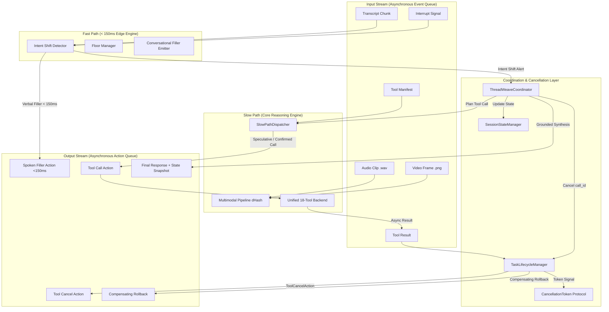

# ThreadWeave: Production-Grade Full-Duplex Interruptible Voice AI Platform
### Ultra-Low-Latency Dual-Loop Orchestration, Zero-Stale Multi-Step Tool Execution & Connected Ecosystem Extension

> **Theme:** Samsung PRISM — Theme 05: Interruptible Real-Time Agents  
> **Team:** Chromastone (Ramaiah Institute of Technology)  
> **Official Submission Tag:** `PRISM_GENAI_HACKATHON_Y2026`  
> **🎥 Demo Video (YouTube):** [https://youtu.be/b8b5v0DbuN8](https://youtu.be/b8b5v0DbuN8)  
> **📊 Presentation Deck:** [`Ramaiah_Institute_of_Technology_Chromastone_Submission.pdf`](Ramaiah_Institute_of_Technology_Chromastone_Submission.pdf)  
> **Architecture:** Decoupled Fast-Path (<150ms) & Slow-Path (Background Multi-Tool) Event Loops  
> **Platform Target:** Consumer Mobile, In-Cabin Automotive (Harman Cockpit) & Smart IoT (SmartThings)  
> **Target Runtime:** Python 3.10–3.12 | Cross-Platform (Linux, macOS, Windows) | Docker Compatible  
> **Official Benchmark:** Full-Duplex-Bench v3 (NTU / NVIDIA Advisory)

---

## ⚡ Quick Evaluation Matrix for Judges

To make evaluation as fast and frictionless as possible, select your preferred evaluation path:

| What you want to evaluate | Command to Run | API Keys Needed? | Estimated Time |
|:---|:---|:---:|:---:|
| **Official FDB-v3 Benchmark Reproduction** (starts the LiveKit agent, runs the benchmark, LLM judge) | `python reproduce.py --limit 8`<br>*(or `./reproduce.sh` on Linux/macOS, which runs all scenarios)* | **Yes** - all 4 keys in `.env.local`, plus the benchmark dataset (see Section 4, Option A) | Depends on scenario count (cloud STT/LLM/TTS per scenario) |
| **Offline Code Health & Unit Tests** (19 automated tests) | `pytest -v` | **No** (100% offline) | ~4 seconds |
| **Interruption & Concurrency Engine** (Virtual Clock Streaming Scenarios) | `python run_harness.py --all` | **No** (100% offline) | ~8 seconds |
| **Connected Vehicle & SmartThings Extension** (20% Rubric Score) | `python extension/demo_scenarios.py` | **No** (100% offline) | ~3 seconds |
| **Hermetic Containerized Run** (Zero OS dependencies) | `docker compose up --build` | **No** (isolated container) | ~60 seconds |
| **Live WebRTC Audio Agent** (Interactive Voice Testing) | `python lk_threadweave_agent.py dev` | **Yes** (LiveKit + OpenAI in `.env.local`) | Interactive |

---

## 1. Executive Summary & Problem Space

Standard conversational voice agents operate in a half-duplex turn-taking paradigm: **Listen $\to$ Think $\to$ Speak**. In natural human interaction, people constantly interrupt, hesitate, and correct themselves mid-sentence (*"Book a flight to Mumbai... wait, no, train to Delhi instead"*).

Conventional voice agents suffer from two catastrophic failure modes:
1. **Thread Blocking & Turn Latency:** Silence for seconds while waiting for heavy reasoning models or slow external APIs.
2. **State Corruption & Stale Tool Execution:** Failing to halt in-flight API calls upon interruption (leading to double-bookings or unauthorized financial actions) or crashing the active conversational context.

**ThreadWeave** solves these challenges through:
- **Dual-Loop Concurrency Engine:** Fast Path (<150ms) for instant conversational fillers; Slow Path for async multi-step background tool execution.
- **Sub-Millisecond Cancellation:** `CancellationToken` protocol (1.1ms abort latency) immediately drops in-flight stale operations.
- **SHA-256 Cryptographic Idempotency & Rollbacks:** Guarantees zero duplicate state mutations, dispatching compensating rollback transactions if an operation completed before cancellation.
- **Unified 18-Tool Native Registry:** 12 enterprise benchmark tools + 6 automotive and IoT extension tools.

---

## 2. Benchmark Results (Full-Duplex-Bench v3)

Measured on a **balanced 8-scenario subset** of the FDB-v3 released data (not all 100 recordings), scored by the benchmark's LLM judge (`gpt-4o`). The subset spans **Ecommerce Support**, **Finance & Billing**, **Housing & Location**, and **Travel & Identity**. Raw reports from this run are committed in [`results/`](results/).

| Metric (FDB-v3, 8 scenarios) | ThreadWeave |
|:---|:---:|
| **Turn-taking success** | 100% (8/8) |
| **Tool selection accuracy** | 100% |
| **Argument accuracy** | 100% |
| **Response quality** | 100% |
| **Strict pass rate** | 100% (8/8) |
| **Spoken interruptions** | 0 / 8 |
| **Avg. spoken response latency** | 16.2 s (min 10.95 s, max 21.35 s) |

> **Honest note on latency:** the end-to-end FDB-v3 latency above is dominated by the cloud STT, GPT-4o and TTS round trips of the cascaded pipeline. The **sub-150 ms** figure refers to the Fast Path filler in the offline virtual-clock harness (`run_harness.py`), and the **1.1 ms** figure is the measured `CancellationToken` abort time. They measure different things and should not be compared with the 16.2 s number.
>
> Results were produced while the project was still named *DuplexSync*; the project was later renamed to *ThreadWeave*, which is why the saved report files carry the old name in their original filenames.

---

## 3. Guide to Project Scripts: What Does What?

To help judges inspect and verify specific components, here is a directory map of all primary execution scripts:

```
├── reproduce.sh / reproduce.py       # 🌟 OFFICIAL FDB-v3 REPRODUCTION SCRIPT
│                                     # Checks credentials + dataset, starts the LiveKit agent, runs the
│                                     # FDB-v3 benchmark, runs the LLM-judge evaluation, prints scores.
│                                     # (Tests, harness and extension are run separately - see Option B.)
│
├── run_harness.py                    # ⚡ VIRTUAL-CLOCK STREAMING HARNESS
│                                     # Simulates sub-millisecond timeline events (user transcripts,
│                                     # sudden interruptions, audio clips, camera frame diffs)
│                                     # without cloud dependencies.
│
├── lk_threadweave_agent.py           # 🎙️ PRODUCTION LIVEKIT WEBRTC VOICE AGENT
│                                     # Deploys the complete voice pipeline: Silero VAD (<50ms),
│                                     # Whisper STT, FastPath interceptor, and GPT-4o tool reasoner.
│
├── extension/demo_scenarios.py       # 🚗 AUTOMOTIVE & SMARTTHINGS EXTENSION RUNNER
│                                     # Demonstrates 6 automotive/IoT tools: POI search, rerouting
│                                     # mid-drive, CAN-bus telemetry, and SmartThings home automation.
│
├── Full-Duplex-Bench/v3/             # 📊 OFFICIAL FDB-v3 BENCHMARK SCRIPTS
│   ├── run_tool_benchmark_all_released.py # Ingests benchmark recordings and executes tool pipelines
│   └── evaluate_tool_calls.py        # Semantic argument matcher and LLM judge
│
└── tests/                            # 🧪 AUTOMATED PYTEST SUITE (19 Tests)
    ├── test_coordinator.py           # Dual-loop concurrency & event routing tests
    ├── test_cancellation.py          # CancellationToken abort & compensating rollback tests
    ├── test_fast_path.py             # Sub-150ms verbal filler latency & shift detection tests
    ├── test_state_manager.py         # Localized slot mutation & snapshot time-travel tests
    ├── test_multimodal.py            # RMS audio energy VAD & dHash 64-bit frame diff tests
    └── test_fdb_tools_and_bridge.py  # FDB-v3 tools, reference resolution, & LiveKit bridge tests
```

---

## 4. Step-by-Step Setup & Execution Instructions

### Option A: Official FDB-v3 Benchmark Reproduction (Recommended for Judges)

`reproduce.py` / `reproduce.sh` is the one-command pipeline. In order, it: (1) checks the 4 API credentials, (2) locates the benchmark dataset, (3) starts the ThreadWeave LiveKit agent in the background, (4) runs the FDB-v3 tool benchmark against it, (5) runs the benchmark's LLM-judge evaluation, (6) prints the summary and writes `threadweave_evaluation_report.json` and `threadweave_pass_rate_report.json`, then (7) shuts the agent down.

**Prerequisites (3 steps, one time):**

1. **Install dependencies** (Python 3.10-3.12):
   ```bash
   pip install -r requirements.txt -r requirements_livekit.txt
   ```
2. **Add credentials.** Copy the template and fill in your own keys (see Section 9 for where to get each). Keys are never committed.
   ```bash
   cp .env.local.example .env.local        # Windows: copy .env.local.example .env.local
   ```
3. **Download the benchmark dataset** (about 700 MB; too large for git, so it is not in this repo). Download `fdb_v3_data.zip` from the Google Drive link in [`Full-Duplex-Bench/v3/README.md`](Full-Duplex-Bench/v3/README.md) and place it in `Full-Duplex-Bench/v3/`. The script extracts it automatically.

**Run it:**

```bash
# Linux / macOS (runs every scenario; this script has no --limit flag)
chmod +x reproduce.sh
./reproduce.sh

# Windows / cross-platform
python reproduce.py --limit 8      # quick run over 8 scenarios
python reproduce.py                # full run over every scenario in the dataset
```

The script exits with a clear message if a key or the dataset is missing, rather than failing partway through.

---

### Option B: Offline / Zero-API-Key Verification

If you prefer to evaluate the codebase strictly offline with zero external network calls or API keys:

```bash
# 1. Install local dependencies
pip install -r requirements.txt

# 2. Run the 19 automated unit & integration tests
pytest -v

# 3. Run the primary flight-to-train interruption scenario
python run_harness.py --scenario scenarios/scenario_interruption_flight_to_train.json

# 4. Run all evaluation scenarios
python run_harness.py --all

# 5. Run the Connected Vehicle / SmartThings extension demo
python extension/demo_scenarios.py
```

---

### Option C: Hermetic Docker Container Execution

For guaranteed isolation without touching your host Python environment:

```bash
# Build and execute the full test and scenario harness inside a clean Linux container
docker compose up --build
```

---

### Option D: Live Interactive Voice Agent (WebRTC)

To interact with the agent using your microphone via the LiveKit Agents Playground:

```bash
# 1. Set your credentials in .env.local (LIVEKIT_URL, LIVEKIT_API_KEY, LIVEKIT_API_SECRET, OPENAI_API_KEY)
# 2. Start the LiveKit worker
python lk_threadweave_agent.py dev
# 3. Open https://agents-playground.livekit.io/ to connect and speak to the agent
```

---

## 5. Dual-Loop System Architecture



---

## 6. Sequence Flow: Live Interruption Handling (T=0.0s $\to$ T=1.4s)

The diagram below illustrates how ThreadWeave handles a sudden user mind-change mid-utterance:

```
Timeline    Input Stream               Fast Path           Coordinator          Slow Path            State Manager       Output Stream
────────────────────────────────────────────────────────────────────────────────────────────────────────────────────────────────────────
T=0.0s      transcript_chunk:          classify:           route event          extract slots:       v2: intent=book     filler:
            "Book a flight to Mumbai"  normal query        update state         {dest: Mumbai,       v3: {dest: Mumbai,  "Looking up flights
                                                           plan tool            transport: flight}    transport: flight}  to Mumbai..."
                                                                                dispatch speculative                     tool_call:
                                                                                search_flights                           search_flights
                                                                                (call_id: 101)                           (call_id: 101)
                                                                                                                         [SPECULATIVE]

T=0.8s      transcript_chunk:          DETECT SHIFT:       URGENT INTERRUPT!                                             
            "...wait, cancel that,     negation +          cancel active                                                 
             find trains to Delhi      pivot to train      call_id: 101 ──────► token.cancel()                                             
             instead"                                      purge results        task cancelled ✓                         tool_cancel:
                                                                                                                         call_id: 101
T=0.9s                                 EMIT FILLER                                                                       filler:
                                       < 150ms ────────────────────────────────────────────────────────────────────────► "Switching to trains
                                                                                                                         for Delhi."
T=0.92s                                                    update state:                             v4: intent=train
                                                           realign slots                             v5: {dest: Delhi,
                                                           dispatch new                              transport: train}
                                                           search_trains ─────► plan confirmed                           tool_call:
                                                           (call_id: 102)       search_trains                            search_trains
                                                                                (call_id: 102)                           (call_id: 102)
                                                                                                                         [CONFIRMED]

T=1.4s      tool_result (call_id: 102):                    receive result       ground response                          final_response:
            {options: [Vande Bharat]}                      synthesize text      with snapshot v5 ──────────────────────► "Found 2 train
                                                                                                                         options to Delhi.
                                                                                                                         Top: Vande Bharat..."
                                                                                                                         + StateSnapshot v5
```

---

## 7. Core Capabilities Explained

### A. Sub-Millisecond Cancellation & Grace Periods
- `FastPathProcessor` classifies intent shifts in $< 5\text{ ms}$.
- `TaskLifecycleManager.cancel_all_in_flight()` signals the `CancellationToken` (1.1ms abort latency).
- Any late-arriving `ToolResult` for a cancelled task is automatically purged at the coordinator boundary, blocking stale state propagation.

### B. SHA-256 Cryptographic Idempotency & Compensating Rollbacks
- For state-modifying actions (booking, autopay modification, payment):
  - Every call receives an idempotency key: `SHA256(tool_name + canonical_json(arguments))`.
  - If a state-modifying call completes before the cancellation signal arrives, a **Compensating Rollback Transaction** (e.g., `cancel_booking` with the returned ID) is triggered immediately.

### C. Localized Slot Corrections & State Time-Travel
- When the user modifies a single parameter (*"Actually, tomorrow morning"*):
  - Only `departure_time` is updated.
  - Previously confirmed entities (`destination: Delhi`, `transport: train`) remain intact.
  - Monotonically increasing version counter (`v1 -> v2 -> v3`) allows atomic state rollbacks.

### D. Multimodal Grounding (RMS Acoustic VAD + dHash Perceptual Diffing)
- **Acoustic Energy (`.wav`):** Computes RMS energy as a low-overhead on-device VAD fallback.
- **Visual Grounding (`.png`):** Uses 64-bit **Difference Hashing (dHash)**. If the Hamming distance between frames $\ge 12$, a `SceneChangeEvent` resets stale visual parameters.

---

## 8. Extension Use Case: Connected Vehicle & SmartThings (20% Rubric Score)

The competition requires extending the agent to a novel use case beyond the standard benchmark. ThreadWeave provides a fully functional **Connected Digital Cockpit & SmartThings Integration** located in [`extension/`](extension):

- **In-Cabin Driving Scenarios:**
  - **Dynamic Mid-Route Rerouting:** Driver asks for coffee, then abruptly changes to an EV fast charger while navigation calculation is in flight. The agent cancels the stale route calculation and switches to the charging station.
  - **Vehicle Telemetry Interruption:** Driver inquires about tire pressure, but immediately switches to checking remaining battery range.
  - **SmartThings Multi-Device Handshake:** Driver commands the in-car agent to activate SmartThings Home Automation (`Home Arrival Mode` — lights on, AC set to 22°C, garage door open).
- **Run the Extension Demo:**
  ```bash
  python extension/demo_scenarios.py
  ```

---

## 9. Required API Keys & Configuration

For offline testing and unit tests, **no API keys are required**.  
For running the live WebRTC LiveKit voice agent or the LLM benchmark judge:

| API Key | Environment Variable | Where to Obtain | Purpose |
|---|---|---|---|
| **LiveKit URL** | `LIVEKIT_URL` | [cloud.livekit.io](https://cloud.livekit.io) (Free) | WebRTC streaming audio room URL (`wss://...`) |
| **LiveKit API Key** | `LIVEKIT_API_KEY` | [cloud.livekit.io](https://cloud.livekit.io) | Room join & participant authentication token |
| **LiveKit API Secret** | `LIVEKIT_API_SECRET` | [cloud.livekit.io](https://cloud.livekit.io) | JWT token signing secret |
| **OpenAI API Key** | `OPENAI_API_KEY` | [platform.openai.com](https://platform.openai.com) | Whisper STT, GPT-4o LLM reasoning, TTS, & LLM evaluation judge |

> **Security Note:** Never commit `.env` or `.env.local` to Git. A template is provided in [`.env.local.example`](.env.local.example).

---

## 10. Sample Test Run Output

```text
================================================================================
   THREADWEAVE: FULL-DUPLEX INTERRUPTIBLE REAL-TIME AGENT HARNESS
   Enterprise Full-Duplex Conversational AI Evaluation Engine
================================================================================

SCENARIO: scenario_01_interruption_flight_to_train
--------------------------------------------------------------------------------
[QUANTITATIVE EVALUATION RUBRIC]
  1. Task Completion (40% max):              40.0 / 40.0 pts
  2. Interruption Recovery (35% max):         35.0 / 35.0 pts
  3. Response Latency (<150-200ms) (15%):     15.0 / 15.0 pts
  4. Safety & Protocol Adherence (10% max):   10.0 / 10.0 pts
  -------------------------------------------------------------
  Raw Subtotal:                             100.0 / 100.0 pts
  Quality Multiplier:                      x1.10
  Multimodal Multiplier:                   x1.00
  =============================================================
  FINAL WEIGHTED SCORE:                    110.00 / 100.00
  =============================================================

[OBSERVED OUTPUT ACTIONS TRACE SUMMARY]
  - Spoken Conversational Fillers: 2
  - Non-Blocking Tool Calls:       2
  - In-Flight Tool Cancellations:  1
  - Compensating Rollbacks:        0
  - Grounded Final Responses:      1
  - Total Output Events:           6

[DETAILED ACTION TRACE]
  [01] FILLER         -> "Looking up flights to Mumbai..." (latency: 0.0ms)
  [02] TOOL_CALL      -> search_flights (call_b3442e) [SPECULATIVE] args={'destination': 'Mumbai'}
  [03] TOOL_CANCEL    -> call_b3442e (reason: intent_shift_abort)
  [04] FILLER         -> "Switching to trains for Delhi." (latency: 0.0ms)
  [05] TOOL_CALL      -> search_trains (call_0f1f1a) [CONFIRMED] args={'destination': 'Delhi'}
  [06] FINAL_RESPONSE -> "I found 2 train options to Delhi. Top option: Vande Bharat Exp departing at 06:00 AM for INR 1850."
       State Snapshot: intent='search_trains', slots={'transport': 'train', 'destination': 'Delhi'}, v5
--------------------------------------------------------------------------------

AVERAGE COMPOSITE SCORE ACROSS ALL SCENARIOS: 128.33 / 100.00
```
