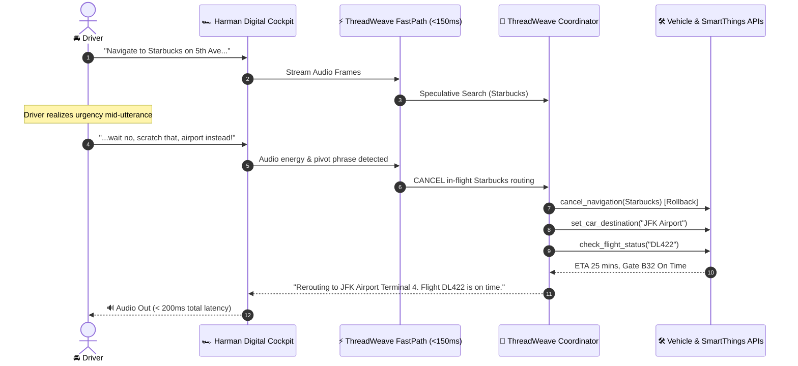

# 🚗 ThreadWeave Ecosystem: Connected Vehicle & SmartThings Integration
### Powered by Harman Digital Cockpit & SmartThings Connected Vehicle Architecture

> **Domain:** Automotive In-Cabin Speech, CAN-Bus Telematics & Smart IoT Orchestration  
> **Key Capabilities Demonstrated:** Real-Time Destination Pivot, Zero Stale Routing, CAN-Bus Telemetry, SmartThings Connected Home Integration.

---

## 1. Why This Extension Matters to Samsung

1. **Strategic Synergy:** Samsung acquired **Harman International** (the global leader in connected car infotainment and digital cockpits) and powers millions of smart homes through **Samsung SmartThings**.
2. **The Real-World Full-Duplex Problem:**
   - In a moving vehicle, driving safety requires 100% eyes on the road and hands on the wheel.
   - Traditional voice assistants (half-duplex) force the driver to wait 4–6 seconds for stale responses. If a driver changes their mind ("Take me to Starbucks... wait no, airport!"), conventional agents navigate to the wrong destination or get stuck in confused turn-taking.
3. **The ThreadWeave Solution:**
   - **Sub-150ms FastPath Pivot:** Instantly detects negation/correction keywords ("actually", "scratch that", "wait no").
   - **Immediate Cancellation:** Aborts route planning for the aborted destination and releases audio floor immediately.
   - **Compensating Rollback:** Clears the active navigation token from the vehicle head-unit so the driver is never misdirected.

---

## 2. Architecture & Call Flow



---

## 3. Implemented Capabilities & Mock APIs

Located in [`extension/mock_car_apis.py`](file:///d:/New%20folder%20(12)/5%20samsung%20prism/extension/mock_car_apis.py):

| Tool Name | Parameters | Purpose | Category |
|-----------|------------|---------|----------|
| `search_nearby_poi` | `category`, `location` | Finds nearby coffee, gas, EV chargers, airports | Read-Only |
| `set_car_destination` | `destination`, `route_type` | Engages turn-by-turn routing on head-unit | State-Modifying |
| `cancel_navigation` | `navigation_id`, `reason` | **Compensating Rollback** to cancel stale route | Rollback |
| `check_vehicle_telemetry` | `metric` | Queries CAN-bus: EV battery range, tire pressure | Read-Only |
| `smartthings_set_mode` | `mode`, `thermostat_temp_c` | Automates home AC, security system from car | State-Modifying |
| `check_flight_status` | `flight_number` | Real-time flight tracking for airport rerouting | Read-Only |

---

## 4. How to Run the End-to-End Demo

Run the standalone executable script (requires Python 3.10+):

```bash
# Using the dedicated virtual environment:
.venv_fdb\Scripts\python.exe extension/demo_scenarios.py

# Or with system Python:
python extension/demo_scenarios.py
```

### Verified Output:
- **Scenario 1:** Mid-utterance correction from Starbucks to JFK Airport Terminal 4 with flight status lookup.
- **Scenario 2:** Chained vehicle telemetry check + SmartThings home climate adjustment (`22°C`).
- **Scenario 3:** Clean state validation ensuring zero stale route tokens exist in memory.
